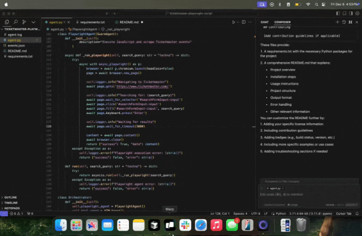

# Event Scraper Bot

<p align="center">
  
</p>

An automated event scraping system that extracts event information from Ticketmaster using a multi-agent approach.

## Features

- Automated web scraping using Playwright
- HTML content parsing and cleaning
- Intelligent event data extraction using Azure OpenAI's GPT models
- Structured JSON output for event data
- Comprehensive logging system

## Prerequisites

- Python 3.8+
- Azure OpenAI API access
- Required Python packages (see requirements.txt)

## Installation

1. Clone the repository:
   ```bash
   git clone <repository-url>
   ```

2. Install required packages:
   ```bash
   pip install -r requirements.txt
   ```

3. Set up environment variables:
   ```bash
   export AZURE_OPENAI_API_KEY=your_api_key
   export AZURE_OPENAI_ENDPOINT=your_endpoint
   ```

## Usage

Run the script with the default search query ("techno"):

Run the main script: